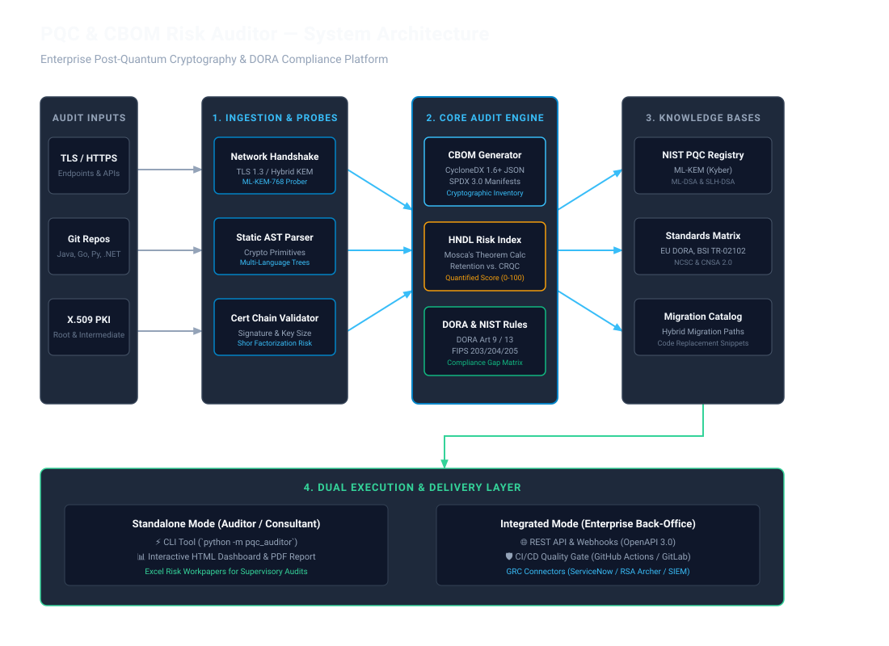

# System Architecture: PQC & CBOM Risk Auditor

## 1. Architectural Principles & Goals

The **PQC & CBOM Risk Auditor** is architected as a modular, high-throughput, security-hardened platform designed to discover, quantify, and govern cryptographic resilience across distributed enterprise environments.

### Core Architectural Tenants:
* **Zero Data Retention:** Source code and endpoint payloads are processed strictly in-memory; no proprietary intellectual property or private cryptographic keys are stored or transmitted.
* **Pluggable Discovery Engines:** Extensible architecture supporting both active network probing (TLS 1.2/1.3, mTLS) and passive static code analysis (AST parsing across multiple languages).
* **Dual Execution Model:** Designed for dual usage: a lightweight, single-command CLI/Dashboard for security auditors, and a headless, containerized REST API with webhooks for automated back-office & CI/CD orchestration.
* **Deterministic & Standards-Based Outputs:** Exports standardized **CycloneDX v1.6+ CBOM** and **SPDX 3.0** formats, paired with cryptographic run hashes for audit traceability.

---

## 2. Visual Architecture Diagram

The system follows a 4-tier decoupled pipeline:



*(An interactive HTML version is available at [`docs/architecture-diagram.html`](architecture-diagram.html)).*

---

## 3. Detailed Layer Breakdown

```
+-----------------------------------------------------------------------------------+
|                            1. AUDIT INGESTION LAYER                               |
|  +---------------------------+  +----------------------+  +--------------------+  |
|  | Network Endpoint Prober   |  | Static AST Parser    |  | PKI / X.509 Parser |  |
|  | - TLS 1.3 / Hybrid KEM    |  | - Python, Java, Go   |  | - Leaf / CA Chains |  |
|  | - Cipher Suite Enum       |  | - .NET, C/C++ OpenSSL|  | - Expiry vs CRQC   |  |
|  +---------------------------+  +----------------------+  +--------------------+  |
+------------------------------------------+----------------------------------------+
                                           |
                                           v
+-----------------------------------------------------------------------------------+
|                             2. CORE AUDIT ENGINE                                  |
|  +---------------------------+  +----------------------+  +--------------------+  |
|  | CBOM Generator            |  | HNDL Risk Engine     |  | DORA & NIST Engine|  |
|  | - CycloneDX 1.6+ JSON/XML |  | - Mosca's Theorem    |  | - DORA Art 9 / 13  |  |
|  | - Algorithm OID Mapping   |  | - Retention Exposure |  | - BSI TR-02102     |  |
|  +---------------------------+  +----------------------+  +--------------------+  |
+------------------------------------------+----------------------------------------+
                                           |
                                           v
+-----------------------------------------------------------------------------------+
|                        3. REGULATORY & THREAT INTELLIGENCE                        |
|  +---------------------------+  +----------------------+  +--------------------+  |
|  | NIST FIPS Standards KB    |  | Cryptographic Agility|  | Remediation Play-  |  |
|  | - FIPS 203/204/205 Specs  |  | - Hardening Profiles |  |   book Catalog     |  |
|  +---------------------------+  +----------------------+  +--------------------+  |
+------------------------------------------+----------------------------------------+
                                           |
                                           v
+-----------------------------------------------------------------------------------+
|                     4. DUAL EXECUTION & DELIVERY INTERFACES                       |
|  +---------------------------------------+  +----------------------------------+  |
|  | A. Standalone Auditor Mode            |  | B. Integrated Enterprise Mode    |  |
|  | - CLI Binary (`python -m pqc_auditor`)|  | - REST API / Webhooks (OpenAPI)  |  |
|  | - Interactive HTML / PDF Dashboard    |  | - CI/CD Quality Gate (PR Block)  |  |
|  | - Excel Risk Workpapers               |  | - GRC Connectors (ServiceNow)    |  |
|  +---------------------------------------+  +----------------------------------+  |
+-----------------------------------------------------------------------------------+
```

### Layer 1: Ingestion & Probes
1. **TLS & Network Handshake Prober:**
   * Initiates TLS 1.3 `ClientHello` advertisements including draft and standard PQC Key Encapsulation groups: `X25519MLKEM768`, `SecP256r1MLKEM768`, `Kyber768`, alongside legacy `X25519` and `secp256r1`.
   * Evaluates session resumption, post-quantum client authentication, and ALPN negotiations.
2. **Multi-Language Static AST Parser:**
   * Employs language-specific tree parsers to scan source code repositories for direct cryptographic library invocations:
     * **Java:** `java.security`, `javax.crypto`, BouncyCastle PQC provider (`org.bouncycastle.pqc`).
     * **Python:** `cryptography`, `pycryptodome`, `hashlib`, `ssl`.
     * **Go:** `crypto/*`, `golang.org/x/crypto`, `github.com/cloudflare/circl`.
     * **C# / .NET:** `System.Security.Cryptography`, BouncyCastle C#.
     * **C / C++:** OpenSSL 3.x / 1.1.1, liboqs (Open Quantum Safe).
3. **PKI & Certificate Validator:**
   * Traverses end-entity certificates up to Root Trust Anchors.
   * Identifies quantum vulnerability points (RSA-2048/4096 signature forgery risks under Shor's algorithm).

### Layer 2: Core Audit Engine
1. **CBOM Engine (CycloneDX 1.6+):**
   * Aggregates detected algorithms, key sizes, modes of operation (e.g. CBC, GCM), padding schemes, and classical/quantum security bits into a unified schema.
2. **HNDL (Harvest Now, Decrypt Later) Risk Calculator:**
   * Calculates vulnerability timelines:
     $$\text{Risk Exposure} = \max(0, (T_{\text{current}} + T_{\text{retention}} + T_{\text{migration}}) - Z_{\text{quantum}})$$
   * Normalizes the score between $0$ (Fully Post-Quantum Protected) and $100$ (Critical Long-term Exposure).
3. **DORA & Compliance Mapping Engine:**
   * Maps every cryptographic asset and finding to DORA Article 9 (Cryptographic controls & key management) and Article 13 (ICT systems security).

### Layer 3: Threat Intelligence & Standards
* Maintained database of NIST PQC standards (FIPS 203 ML-KEM, FIPS 204 ML-DSA, FIPS 205 SLH-DSA), BSI TR-02102 requirements, and NCSC post-quantum transition roadmaps.

### Layer 4: Dual Delivery Interfaces
* **Standalone Auditor Suite:** Generates self-contained HTML/PDF reports and Excel audit workpapers for independent consultants and risk officers.
* **Enterprise Back-Office & CI/CD:** Exposes an OpenAPI 3.0 REST API running in Docker, allowing orchestrators (ServiceNow, Jira, GRC tools) and CI/CD pipelines to trigger scans and ingest CBOM telemetry.

---

## 4. Trust Boundaries & Security Model

```
[ External / Uncontrolled ]
  - Public TLS Endpoints (HTTPS, mTLS, APIs)
  - Remote Git Repositories (GitHub, GitLab, Bitbucket)
------------------------- [ Trust Boundary 1: Ingestion Gateway ] -------------------------
[ Execution Boundary (Local or Container VPC) ]
  - Read-Only In-Memory Parser (No disk caching of raw code)
  - Core Audit & Risk Engine
  - Local Standards Knowledge Base
------------------------- [ Trust Boundary 2: Output Delivery ] ---------------------------
[ Sanitized Output / Deliverables ]
  - CycloneDX CBOM JSON/XML
  - Anonymized Risk Dashboards (PDF/HTML)
  - REST API Webhook Responses to Back-Office GRC
```

1. **Non-Intrusive Probe Policy:** The probe engine limits connection concurrency, adheres to strict timeouts, and never sends malicious fuzzing payloads.
2. **Zero Ingress of Proprietary Secrets:** AST scanning operates purely on syntax trees to extract algorithm identifiers and key sizes. Code bodies and credentials are automatically stripped and never stored.
